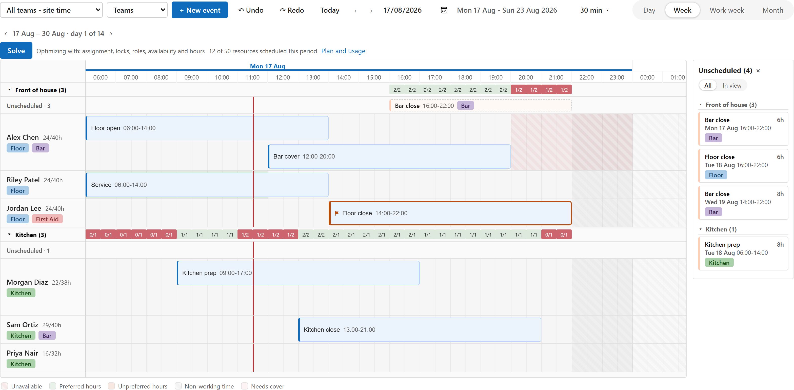
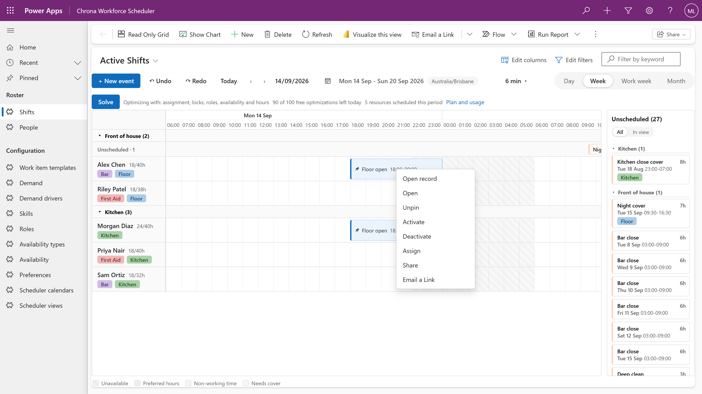
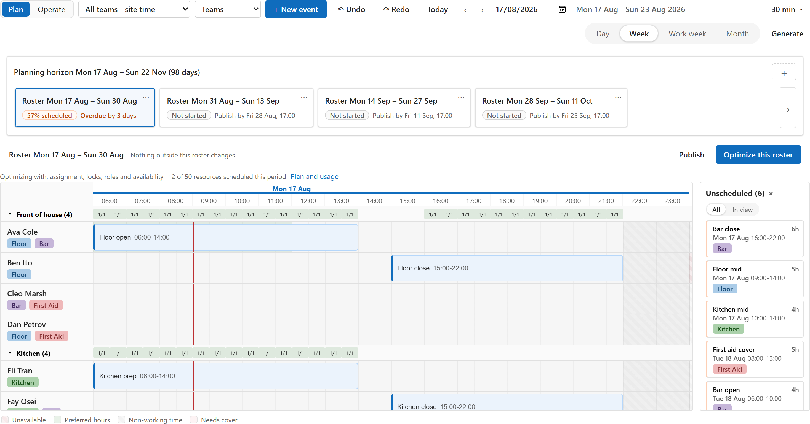
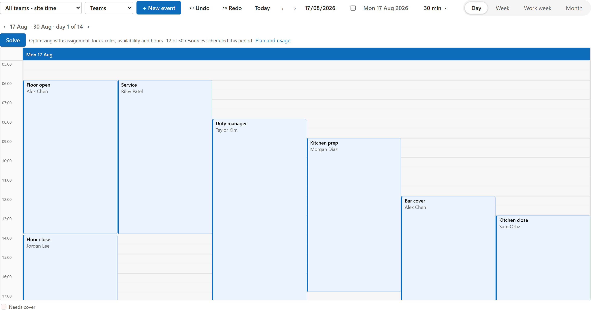
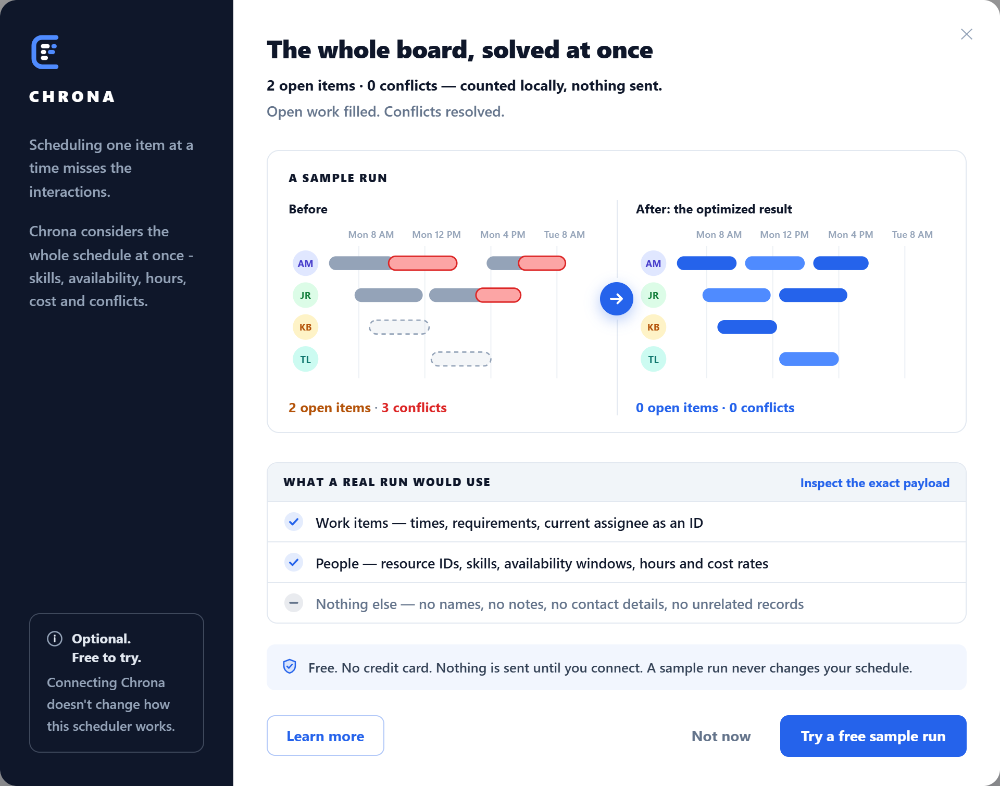
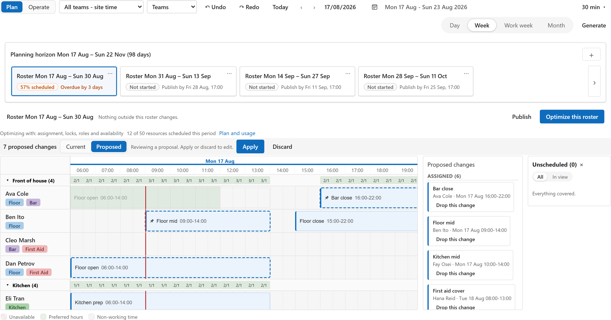
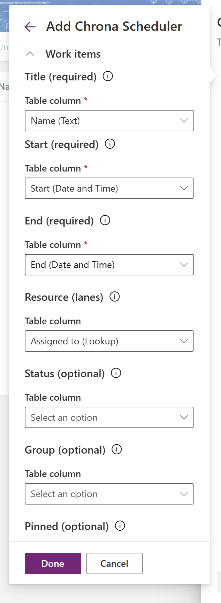

# Chrona Scheduler

A drag-and-drop scheduler for any Dataverse table with a start and an end: a Power Apps component framework (PCF) control, shipped as one managed solution. No account, no second system; it lives on a view in the model-driven app you already have.

Bind it to a view of your table in the view designer, map Title, Start and End, and every row becomes a bar you can drag. Add a lookup to the person or asset a row belongs to and the board grows lanes and an unscheduled panel. Every edit is written to your table as it happens, with who made it.

**On this page:** [Features](#features) · [Staff rostering](#staff-rostering) · [Optimize](#optimize) · [Performance](#performance) · [Basic setup](#basic-setup) · [Where things are set up](#where-things-are-set-up) · [Download](#download) · [Support](#support)

**Documentation:** [Install guide](docs/install.md) · [Bindings](docs/bindings.md) · [Where things are set up](docs/configure.md) · [Questions](docs/faq.md) · [All pages](docs/README.md) · [llms.txt](llms.txt) for agents

## Features

**Views**
- Resource timeline with lanes: day, week, work week and month time scales, groups such as teams, a current-time line, non-working time and weekend shading.
- Calendar layouts when no resource is bound: day, week and month.
- The whole view loads, up to 20,000 rows, and only the visible rows are rendered.

**Editing**
- Drag to move, drag the edges to resize, with snapping to the time scale.
- Create by dragging on an empty slot or with **New event**; a details dialog for everything else.
- Select several bars and use **Move to...** by hours, days or weeks, or **Reassign to...** another person in one go.
- Copy and paste, undo and redo. Undo writes back to your table too.
- Pin a bar so it keeps its person and time when optimizing.

**Collision detection on every drop**
- Overlaps for the same person, placements outside the working hours, missing skills and booked leave are checked as you drag. Each check is set per scheduler to off, warn or block: a blocked placement snaps back with its reason, a warning lands with a note.
- Text statuses from your columns; open rows show as needing cover.
- Pinned rows stay put; a lock can fix the time, the person, or both.

**Inside your app**
- Right-click a bar for Open record, Chrona's actions and your app's own commands; selecting bars puts them on the app's command bar.
- The app's Fluent theme, light or dark, is the scheduler's theme.
- English and German, following the user's Power Apps language.
- Time shown in the user's time zone.

**Optimize**
- One click sends a pseudonymous copy of the period to the Chrona service and the answer comes back as a proposal on the board. Free daily allowance, no sign-up form.

## Staff rostering

With **Chrona Workforce Scheduler**, the scenario solution for rostering people, the same board gains skills and roles with mismatch highlighting, availability and preference bands, hours against capacity, a coverage strip from demand, shift templates with rotating patterns and generation, roster periods with publish, and a ready-made app.

The day calendar, for a table without a resource lookup:

## Optimize

Optimize fills open work and balances the schedule against the rules you have. Nothing is sent until you choose to connect, and the dialog shows exactly what a run would use.

The answer arrives as a proposal on the same board: proposed placements carry a dashed ring, a moved shift leaves a ghost at its old place, the list on the right names every change with its notes. Drop the ones you disagree with, then **Apply**. Nothing is written before that.

## Performance

Measured in the package's bench in Microsoft Edge on a developer laptop, with 2,000 people and 20,000 shifts:

| What | Time |
| --- | --- |
| Board first painted after the data arrives | 1.2 s |
| Render of the board | 0.4 s |
| Next week | 0.12 s |
| Switch to the month scale | 0.2 s |

Only the rows in view are in the page: 59 bars on screen for 20,000 shifts. In Power Apps the control loads a view in pages of 5,000 rows, up to 20,000 rows.

## Basic setup

1. Import `01-ChronaScheduler_managed.zip` from the [latest release](https://github.com/konfigure8/chrona-scheduler/releases) in **Solutions**, **Import solution**.
2. Give people the security role **Chrona Scheduler User** (**Chrona Scheduler Admin** for those who configure it).
3. Open a view of your table in the view designer, **Components**, **Add a component**, **Chrona Scheduler**, and bind **Title**, **Start** and **End**; bind **Resource** to a lookup for lanes. **Save and publish**.
4. Open the view in your app.

## Where things are set up

- **The property pane** on the view maps your columns: which column is the title, the start, the end, the person, the status, the group, the pin. [docs/bindings.md](docs/bindings.md).
- **Two configuration rows** hold the scheduler's settings: the calendar row for the people table, grouping, capacity and the collision policies; the view row for working hours, weekends, the time scale and the time zone. Connect creates them; you can edit them in the maker portal. [docs/configure.md](docs/configure.md).
- **The toolbar** remembers each person's own choices: the interval, the time scale, weekends, the unscheduled panel.

The full install guide, with the platform's own wording at every step: [docs/install.md](docs/install.md). Questions: [docs/faq.md](docs/faq.md). Agents: [llms.txt](llms.txt).

## Download

`ChronaScheduler-<version>.zip` from the [Releases](https://github.com/konfigure8/chrona-scheduler/releases) page holds the managed solution and the install guide.

## Support

- Something broke: open an [issue](https://github.com/konfigure8/chrona-scheduler/issues/new/choose).
- A question or an idea: start a [discussion](https://github.com/konfigure8/chrona-scheduler/discussions).
- Anything private: support@chrona365.com.
