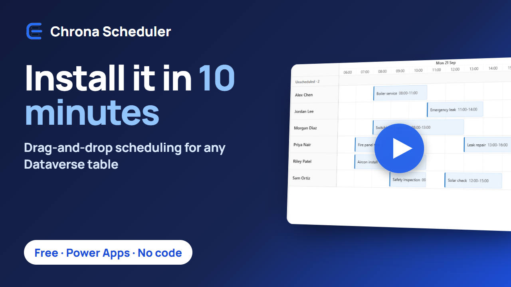
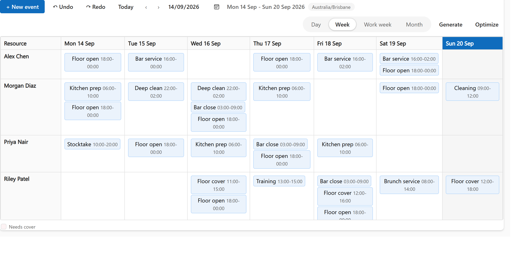

# Chrona Scheduler

**Drag-and-drop scheduling for any Dataverse table, inside your model-driven app. Free, no code, no account.**

A timeline and calendar control for Power Apps: put it on a view of your bookings, jobs, shifts or visits, and every row becomes a bar you can drag. Add a lookup to the person or asset a row belongs to, and the board grows lanes, an unscheduled panel and collision detection. It ships as one managed solution, built on the Power Apps component framework (PCF).

**On this page:** [Why builders pick it](#why-builders-pick-it) · [Try it in ten minutes](#try-it-in-ten-minutes) · [What you get](#what-you-get) · [See it](#see-it) · [When you need optimization](#when-you-need-optimization) · [Staff rostering](#staff-rostering) · [Performance](#performance) · [Trust](#trust) · [Support](#support)

**Documentation:** [Install guide](docs/install.md) · [Bindings](docs/bindings.md) · [Layouts](docs/layouts.md) · [Where things are set up](docs/configure.md) · [Questions](docs/faq.md) · [All pages](docs/README.md) · [llms.txt](llms.txt) for agents

## Why builders pick it

- **Your table, your app.** It works on any table with a title, a start and an end. No new tables to fill, no second system, no sync. Every drag is saved to your row as it happens, with who made it.
- **Ten minutes from import to first drag.** Import one managed solution, bind three columns in the view designer, open the view. No code.
- **Free and self-contained.** No Chrona account, no sign-up, nothing leaves your environment until you choose to connect for optimization.

## Try it in ten minutes

The video walks these steps, from download to first drag, in about six minutes, with captions.

1. Download `ChronaScheduler-<version>.zip` from the [latest release](https://github.com/konfigure8/chrona-scheduler/releases) and import `01-ChronaScheduler_managed.zip` under **Solutions**, **Import solution**.
2. Give people the security role **Chrona Scheduler User** (**Chrona Scheduler Admin** for those who configure it).
3. Open a view of your table in the view designer: **Components**, **Add a component**, **Chrona Scheduler**. Bind **Title**, **Start** and **End**; bind **Resource** to a lookup if you want lanes. **Save and publish**.
4. Open the view in your app and drag.

The [install guide](docs/install.md) walks every step with the platform's own wording, including creating the table and its columns if you are starting from nothing.

## What you get

**Schedule**
- Drag a bar to move it, drag its edges to resize it; it snaps to the time scale you chose.
- Drag open work from the unscheduled panel onto a person to assign it.
- Create by dragging on an empty slot or with **New event**; edit the details in a dialog.
- Select several bars and move them together by hours, days or weeks, or reassign them to another person in one go.
- Copy and paste, undo and redo, all saved to your table.

**Keep it right**
- **Collision detection** on every drop: two shifts on the same person, a shift outside working hours, a person without the required role, a shift over booked leave. Each check is off, a warning or a block, your choice per scheduler. A block snaps the bar back with the reason; a warning lands it with a note.
- Pin a bar so it keeps its person and time; lock the time, the person, or both.
- See hours against capacity on every lane when your people table carries weekly hours.

**Live in your app**
- Right-click a bar for **Open record**, Chrona's actions and your app's own commands; select bars and your command bar works on them.
- Your app's Fluent theme, light or dark. See the [supported languages](docs/faq.md#languages). Times follow each user's time zone.
- A layout per view, set by the maker: timeline lanes, a roster grid, top-down columns or an agenda list; and a color per row by role, group or status when the maker wants one. Day, week, work week and month time scales; groups such as teams or sites; a current-time line; non-working time and weekend shading.
- The whole view loads, up to 20,000 rows.

## See it

The board with the right-click menu, in a model-driven app:

The roster grid, one of four layouts the maker sets per view ([Layouts](docs/layouts.md) shows all four):

The day calendar, for a table without a resource lookup:

## When you need optimization

Optimize fills open work and balances the schedule against the rules you have. It is one click, free to try, and it asks nothing until you choose to connect: the dialog shows what a sample run does before and after, and exactly what a real run would use.

The answer arrives as a proposal on the same board. Proposed placements carry a dashed ring, a moved shift leaves a ghost at its old place, and the list names every change with its notes. Drop the ones you disagree with, then **Apply**. Nothing is written before that. A connected environment gets a free daily allowance of runs.

## Staff rostering

When scheduling turns into rostering, **Chrona Workforce Scheduler** adds the tables and the app for it: roles built from skills, with mismatch highlighting, availability and preferences, hours against capacity, demand and the coverage strip, shift templates with rotating patterns and generation, roster periods with publish. Same board, same control. It is licensed per scheduled person; ask us at support@chrona365.com.

## Performance

Measured in the package's bench in Microsoft Edge on a developer laptop, with 2,000 people and 20,000 shifts:

| What | Time |
| --- | --- |
| Board first painted after the data arrives | 1.2 s |
| Render of the board | 0.4 s |
| Next week | 0.12 s |
| Switch to the month scale | 0.2 s |

Only the rows in view are on the page: 59 bars on screen for 20,000 shifts. In Power Apps the control loads a view in pages of 5,000 rows, up to 20,000 rows.

## Trust

- **Your data stays put.** The free scheduler makes no calls outside your environment. When you connect for optimization, a run sends a copy of the period with ids replaced by placeholders: no names, no notes, no contact details, no unrelated records. You can read the exact payload before the first run.
- **No licence of its own.** The scheduler is a code component in your model-driven app and runs under the Power Apps licences the app already has. There is no Chrona licence for it.
- **A managed solution.** It installs, updates and uninstalls the way every managed solution does. Take it off the views that use it, and the platform deletes it cleanly.
- **Version 0.1.0 is the first public release.** Not there yet: a phone layout. Releases are listed on this page.
- **Built by Chrona**, chrona365.com. Support: support@chrona365.com.

## Support

- Something broke: open an [issue](https://github.com/konfigure8/chrona-scheduler/issues/new/choose).
- A question or an idea: start a [discussion](https://github.com/konfigure8/chrona-scheduler/discussions).
- Anything private: support@chrona365.com.
