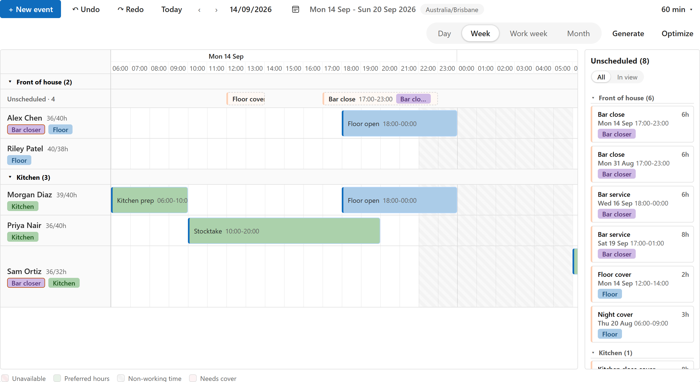
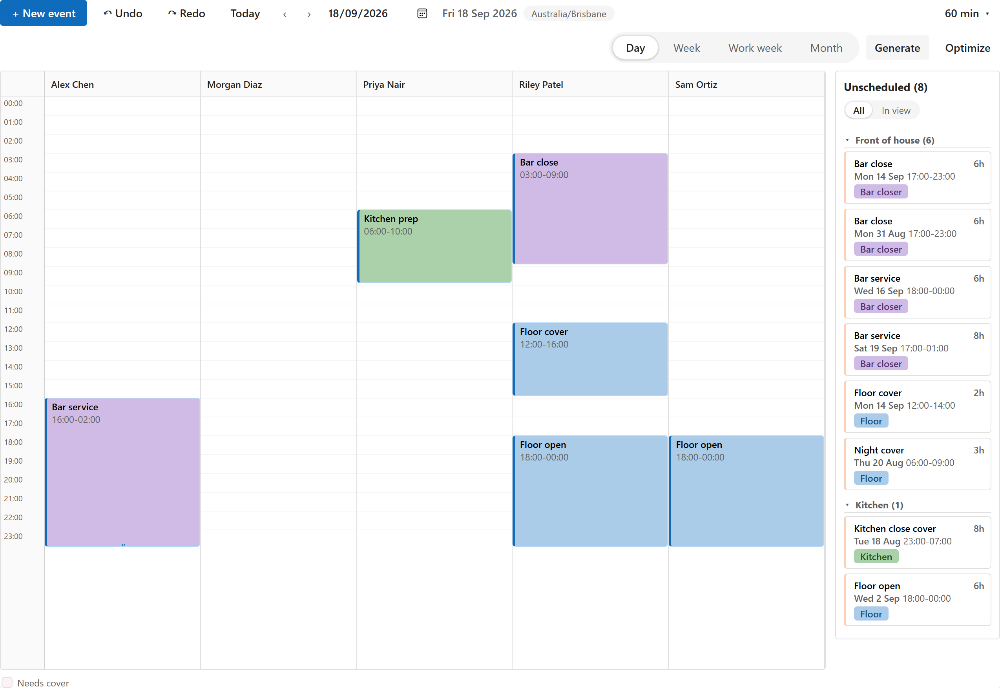
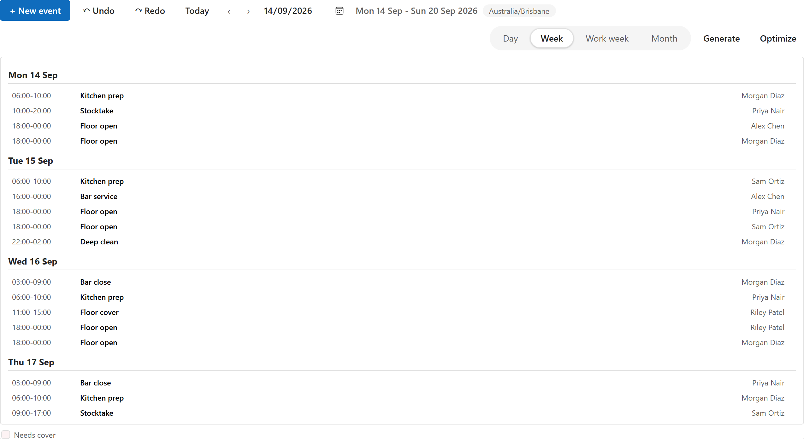

# Layouts

The scheduler draws a view in one of four layouts. The maker picks the layout once, on the view's configuration row (**Layout** on the Chrona Scheduler View row, see [Where things are set up](configure.md)); the people using the view do not switch it. What they do choose, per person, is the interval: Day, Week, Work week or Month, and the rest of the toolbar's settings.

Every layout shows the same rows: the shifts, jobs or visits of the bound view, drag-and-drop scheduling, the right-click menu, the unscheduled panel, and the collision checks. The colors in the pictures come from the view row's **Color by** setting, here set to Role: a bar takes its role's color; Group and Status are the other choices, and nothing leaves the bars neutral.

| Layout | What it draws | Pick it when |
| --- | --- | --- |
| Timeline | One lane per person or asset, time across, bars for the rows. The default, and the only layout with the coverage strip and the roster periods. | Planning against people or assets: who is on, who is free, where the gaps are. |
| Roster grid | One row per person, one column per day, each shift as a chip. | The classic roster sheet: a week or a fortnight at a glance, printed or on a wall screen. |
| Top-down | One column per person, time down the page, bars with their length. | A day at a time, when the length of each shift matters more than the week. |
| Agenda | The rows as a list by day, with the time, the title and the person. | A phone, a narrow pane, or reading the plan rather than moving it. |

Without a Resource lookup bound there are no people or assets, so the timeline layout shows the day, week or month calendar instead.

## Timeline

## Roster grid

## Top-down

## Agenda

## Setting the layout

1. Open the Chrona Scheduler View row for the view (the row whose Bound view is the view's id; Connect creates it).
2. Set **Layout** to Timeline, Roster grid, Top-down or Agenda. Empty means Timeline.
3. Save. The next load of the view draws it that way for everyone.

The time scale (Slot length), the working hours and the weekend default on the same row apply to every layout that draws a time axis.
